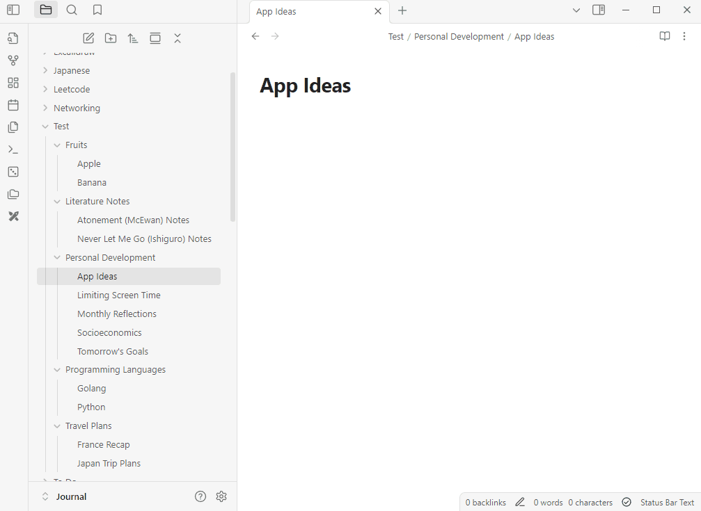
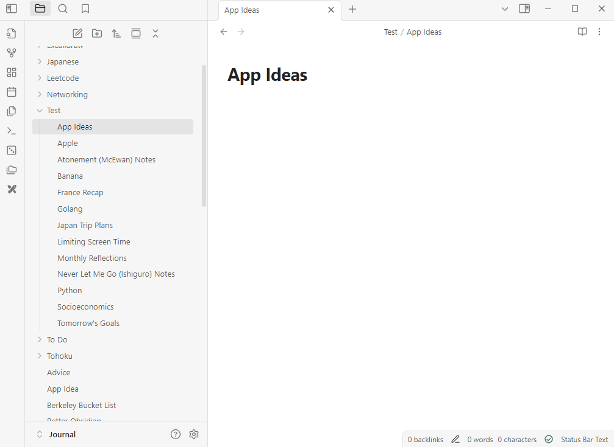

# Better Obsidian

This is my plugin for improving Obsidian basic functionalities.

This project uses TypeScript to provide type checking and documentation.
The repo depends on the latest plugin API (obsidian.d.ts) in TypeScript Definition format, which contains TSDoc comments describing what it does.

## How to use

### Organize Daily Notes

Create a folder to store all your daily notes of format `YYYY-MM-DD [- {TOPIC}]`. 
After doing so, to the settings tab and under **Community Plugins** and the Better Obsidian tab, update the folder name from "N/A" to the `path/to/diary/folder`` from vault root.
Then click the folder icon on the left side of the app window and it should create year folders, month folders within each year, and place the notes into the appropriate folders.
Notes not in the `YYYY-MM-DD` format will be directly under the setting specified folder.
This organize button also works off folders created from previous calls, allowing new files to be placed into the existing year and month folders.

### Journal Recall

After updating the designated recall folder in the settings for Better Obsidian, click the dice button on the left side of the window.
This will give you a random file from the folder specified, allowing you to randomly review previous written notes.
This can be useful in recalling old journal entries to reflect upon.

### Unpack Folder

This is a command that can be found by using the `Ctrl-P` on Windows and `Cmd-P` on Mac. Typing in 'unpack' should yield a `Better Obsidian: Unpack Folder` option.
Selecting this will open up a pop up in which you will be able to submit a path or folder name given the vault root as the root.
Unpack Folder removes all folders, nested folders included, inside the specified folder. The files will not be deleted, remaining inside this folder.
This is helpful in revamping vault structure in cases of folder organzation.

### Automated Folder Generation

This is a command that allows you to enter a directory to automate folder generatoin and the corresponding file sorting. 
All the file names in this directory will be passed into a pipeline which will be vectorized through a text embedding model (bge-base-en-v1.5), and then clustered using DBSCAN. The clustered files with their labels will then be passed to a query to an OpenAI GPT model for folder name generation.
Upon receiving these folder names, the files will be automatically organized into their appropriate folder.

## Manually installing the plugin

- Create a plugins folder under `VaultFolder/.obsidian` if it doesn't already exist.
- Make a directory under this plugins folder titled `better-obsidian`
- Copy over `main.js`, `styles.css`, `manifest.json` to your vault `VaultFolder/.obsidian/plugins/better-obsidian/`.

